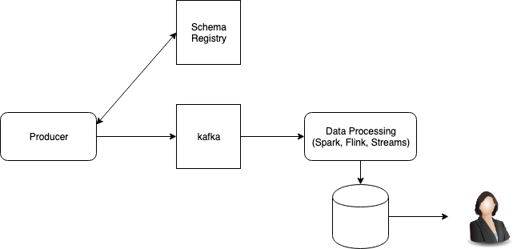

# SKBDA BDA, Hands-on Labs

* [Dataflow](#data-flow)
* [Software Stack](#software-stack)
* [Stream Data Platform](#stream-data-platform)
* [Data Source](#data-source)
* [Data Processing](#data-processing)
* [Streaming Data Integration](#streaming-data-integration)
* [Data Analytics / SQL / Dashboard](#data-analytics)

## Data Flow



1. Source
- Kafka Client (Producer)
- Avro message

2. Event Hub (Kafka)

3. Stream Processing
- Apache Flink
- Kafka Streams

4. Data Store
- RDBMS
- Object Storage (Minio)

5. Data processing and analytics
- Python (jupyter notebook)
- SQL (Hive, Presto, etc...)

## Software stack
```
Zookeeper version: 3.4.9
Kafka version: 2.0.0
Kafka Schema Registry 5.0.0 (confluent)
Kafka Schema Registry UI 0.9.4

```

```
Apache Flink 1.8.0, https://ci.apache.org/projects/flink/flink-docs-release-1.8/
Presto 302, https://prestosql.io/
Minio, https://min.io/
```

```
Apache Avro 1.8.2
```

Tools:
- kadmin, https://github.com/BetterCloud/kadmin
- Kafka Manager, https://github.com/yahoo/kafka-manager

## Stream Data Platform

### Setup Docker containers for dev

IP Address:
```
$ ipconfig getifaddr en0
192.168.1.4

```

```
$ docker --version
$ docker network ls
$ docker network prune

```

Running Docker containers:
```
$ cd labs/docker
$ cat docker-compose.yml
$ docker-compose up -d
$ docker-compose ps

```

Ref.
- Docker, https://docs.docker.com/
- Docker Compose, https://docs.docker.com/compose/

#### mc (Minio client)
```
$ docker pull minio/mc
$ docker run --net docker_default -it --entrypoint=/bin/sh minio/mc

# mc

```

Edit ~/.mc/config.json
```
MINIO_ACCESS_KEY: V42FCGRVMK24JJ8DHUYG
MINIO_SECRET_KEY: bKhWxVF3kQoLY9kFmt91l+tDrEoZjqnWXzY9Eza
```

```
(snip)

		"local": {
			"url": "http://minio:9000",
			"accessKey": "V42FCGRVMK24JJ8DHUYG",
			"secretKey": "bKhWxVF3kQoLY9kFmt91l+tDrEoZjqnWXzY9Eza",
			"api": "S3v4",
			"lookup": "auto"
		},

(snip)
```

Services:
```
Single Zookeeper: $DOCKER_HOST_IP:2181
Single Kafka: $DOCKER_HOST_IP:9092
Kafka Schema Registry: $DOCKER_HOST_IP:18081
Kafka Schema Registry UI: $DOCKER_HOST_IP:8001
Kafka Rest Proxy: $DOCKER_HOST_IP:8082
Kafka Connect: $DOCKER_HOST_IP:8083

```

Browse Presto Web UI:
- http://localhost:8080

Browse Minio Web UI:
- http://localhost:9000

Refs.
- PrestoSQL, https://prestosql.io/
- Minio, https://min.io/

Container ID for Kafka broker(kafka1):
```
$ docker ps --filter name=kafka1 --format={{.ID}}

```


Networking of (Kafka) docker compose, https://github.com/wurstmeister/kafka-docker/wiki/Connectivity

### Sanity check
* CLI
```
-- Basic Ops
$ export KAFKA_BROKER=$(docker ps --filter name=kafka1 --format={{.ID}})
$ docker exec -t -i "$KAFKA_BROKER" \
kafka-topics --create --topic foo --partitions 1 --replication-factor 1 \
--if-not-exists --zookeeper zoo1:2181

$ docker exec -t -i "$KAFKA_BROKER" \
kafka-topics --create --topic hello --partitions 4 --replication-factor 1 \
--if-not-exists --zookeeper zoo1:2181

$ docker exec -t -i "$KAFKA_BROKER" \
kafka-topics --create --topic world --partitions 8 --replication-factor 1 \
--if-not-exists --zookeeper zoo1:2181

$ docker exec -t -i "$KAFKA_BROKER" \
kafka-topics --describe --topic foo --zookeeper zoo1:2181

$ docker exec -t -i "$KAFKA_BROKER" \
kafka-topics --describe --topic hello --zookeeper zoo1:2181

$ docker exec -t -i "$KAFKA_BROKER" \
kafka-topics --describe --topic world --zookeeper zoo1:2181

$ docker exec -t -i "$KAFKA_BROKER" \
bash -c "seq 100 | kafka-console-producer --request-required-acks 1 \
--broker-list kafka1:9092 --topic foo && echo 'Produced 100 messages.'"

$ docker exec -t -i "$KAFKA_BROKER" \
kafka-console-consumer --bootstrap-server kafka1:9092 --topic foo --from-beginning --max-messages 100

-- delete a topic
$ export KAFKA_BROKER=$(docker ps --filter name=kafka1 --format={{.ID}})
$ docker exec -t -i "$KAFKA_BROKER" \
kafka-topics --zookeeper zoo1:2181 --delete --topic topicName
```

or
```
$ docker ps --filter name=kafka1 --format={{.ID}}
c832ec907848

$  docker exec -t -i c832ec907848 bash -l

# ......

```

bin scripts for Kafka:
```
$ docker exec -t -i "$KAFKA_BROKER" bash -l

# echo "KAFKA_HOME=$KAFKA_HOME"
# cd $KAFKA_HOME/bin
# ls -als
```

Create Kafka topics for test:
```
$ export KAFKA_BROKER=$(docker ps --filter name=kafka1 --format={{.ID}})

-- eventcall topic
$ docker exec -t -i "$KAFKA_BROKER" \
kafka-topics --create --topic eventcall --partitions 4 --replication-factor 1 \
--if-not-exists --zookeeper zoo1:2181

```

* Web UI for Kafka producer/consumer (kadmin)
https://github.com/BetterCloud/kadmin

Running kadmin (on localhost):
```
$ cd /path/to/workspace
$ git clone https://github.com/youngwookim/kadmin.git
$ cd kadmin
$ cd dist
$ cp ../application.properties .
```

Edit confs:
```
$ vi application.properties

server.port=9090
```

Run kadmin:
```
$ java -jar shared-kafka-admin-micro-*.jar --spring.profiles.active=kadmin,local
```

Browse kadmin web:
http://localhost:9090/kadmin/

1. Basic producer

```String``` -> ```String```

2. Avro producer
```JSON``` -> AVRO -> ```ByteArray```

Schema Registry UI
- http://localhost:8001

'EventCall' Avro Schema:
```
{
  "type": "record",
  "name": "EventCall",
  "namespace": "com.bettercloud.avro.workflow",
  "fields": [
    {
      "name": "header",
      "type": {
        "type": "record",
        "name": "Header",
        "namespace": "com.bettercloud.avro",
        "fields": [
          {
            "name": "senderId",
            "type": [
              {
                "type": "string",
                "avro.java.string": "String"
              },
              "null"
            ],
            "default": "null"
          },
          {
            "name": "domainId",
            "type": [
              {
                "type": "string",
                "avro.java.string": "String"
              },
              "null"
            ]
          },
          {
            "name": "tenantId",
            "type": {
              "type": "string",
              "avro.java.string": "String"
            }
          },
          {
            "name": "providerId",
            "type": [
              {
                "type": "string",
                "avro.java.string": "String"
              },
              "null"
            ]
          },
          {
            "name": "correlationId",
            "type": [
              {
                "type": "string",
                "avro.java.string": "String"
              },
              "null"
            ]
          },
          {
            "name": "externalCorrelationId",
            "type": [
              {
                "type": "string",
                "avro.java.string": "String"
              },
              "null"
            ]
          },
          {
            "name": "receivedDate",
            "type": [
              "long",
              "null"
            ]
          },
          {
            "name": "eventId",
            "type": [
              {
                "type": "string",
                "avro.java.string": "String"
              },
              "null"
            ]
          },
          {
            "name": "userId",
            "type": [
              {
                "type": "string",
                "avro.java.string": "String"
              },
              "null"
            ]
          },
          {
            "name": "eventMeta",
            "type": [
              "null",
              {
                "type": "array",
                "items": {
                  "type": "record",
                  "name": "MapKeyValueEntry",
                  "namespace": "com.bettercloud.avro.workflow",
                  "fields": [
                    {
                      "name": "key",
                      "type": {
                        "type": "string",
                        "avro.java.string": "String"
                      }
                    },
                    {
                      "name": "value",
                      "type": [
                        "boolean",
                        "int",
                        "long",
                        "float",
                        "double",
                        "bytes",
                        {
                          "type": "string",
                          "avro.java.string": "String"
                        },
                        "null",
                        {
                          "type": "array",
                          "items": [
                            "MapKeyValueEntry",
                            "boolean",
                            "int",
                            "long",
                            "float",
                            "double",
                            "bytes",
                            {
                              "type": "string",
                              "avro.java.string": "String"
                            },
                            "null",
                            {
                              "type": "array",
                              "items": "MapKeyValueEntry"
                            }
                          ]
                        }
                      ]
                    }
                  ]
                }
              }
            ],
            "default": null
          }
        ]
      }
    },
    {
      "name": "eventId",
      "type": {
        "type": "string",
        "avro.java.string": "String"
      }
    },
    {
      "name": "eventParams",
      "type": [
        "null",
        {
          "type": "map",
          "values": [
            "boolean",
            "int",
            "long",
            "float",
            "double",
            "bytes",
            {
              "type": "string",
              "avro.java.string": "String"
            },
            "null",
            {
              "type": "map",
              "values": [
                {
                  "type": "string",
                  "avro.java.string": "String"
                },
                "null"
              ],
              "avro.java.string": "String"
            }
          ],
          "avro.java.string": "String"
        }
      ],
      "default": null
    },
    {
      "name": "values",
      "type": [
        "null",
        {
          "type": "array",
          "items": "MapKeyValueEntry"
        }
      ],
      "default": null
    }
  ]
}
```

EventCall message:
```
{
  "header": {
    "senderId": "f7d7e7c5-1a1f-4d2a-9ae0-ce07e83907fa",
    "domainId": "f7d7e7c5-1a1f-4d2a-9ae0-ce07e83907fa",
    "tenantId": "f7d7e7c5-1a1f-4d2a-9ae0-ce07e83907fa",
    "providerId": "f7d7e7c5-1a1f-4d2a-9ae0-ce07e83907fa",
    "correlationId": "f7d7e7c5-1a1f-4d2a-9ae0-ce07e83907fa",
    "externalCorrelationId": "f7d7e7c5-1a1f-4d2a-9ae0-ce07e83907fa",
    "receivedDate": 1467378058627,
    "eventId": "f7d7e7c5-1a1f-4d2a-9ae0-ce07e83907fa",
    "userId": "f7d7e7c5-1a1f-4d2a-9ae0-ce07e83907fa",
    "eventMeta": [{
      "key": "workflow",
      "value": true
    }, {
      "key": "workflow_directory_integration",
      "value": false
    }]
  },
  "eventId": "f7d7e7c5-1a1f-4d2a-9ae0-ce07e83907fa",
  "eventParams": null,
  "values": [{
    "key": "userId",
    "value": "f7d7e7c5-1a1f-4d2a-9ae0-ce07e83907fa"
  }]
}
```

* Kafka Manager
A tool for managing Apache Kafka.
- https://github.com/yahoo/kafka-manager

Browse kafka-manager web:
- http://localhost:19000

## Data Source

NASDAQ symbols:
- https://datahub.io/core/nasdaq-listings

1. nasdaq-listed
- https://datahub.io/core/nasdaq-listings/r/nasdaq-listed.csv
```
Field information
Field Name	Order	Type (Format)	Description
Symbol	1	string
Company Name	2	string
Security Name	3	string
Market Category	4	string
Test Issue	5	string
Financial Status	6	string
Round Lot Size	7	number
```

2. nasdaq-listed-symbols
- https://datahub.io/core/nasdaq-listings/r/nasdaq-listed-symbols.csv
```
Field information
Field Name	Order	Type (Format)	Description
Symbol	1	string
Company Name	2	string
```

IEX Trading API, https://iextrading.com/developer/docs/
The IEX API is a set of services offered by The Investors Exchange (IEX)
to provide access to data from the Exchange to developers and engineers for free.

https://github.com/WojciechZankowski/iextrading4j


IEX trading, "Quote -- 주식시세":
```
    private final String symbol;
    private final String companyName;
    private final String primaryExchange;
    private final String sector;
    private final String calculationPrice;
    private final BigDecimal open;
    private final Long openTime;
    private final BigDecimal close;
    private final Long closeTime;
    private final BigDecimal high;
    private final BigDecimal low;
    private final BigDecimal latestPrice;
    private final String latestSource;
    private final String latestTime;
    private final Long latestUpdate;
    private final BigDecimal latestVolume;
    private final BigDecimal iexRealtimePrice;
    private final BigDecimal iexRealtimeSize;
    private final Long iexLastUpdated;
    private final BigDecimal delayedPrice;
    private final Long delayedPriceTime;
    private final BigDecimal extendedPrice;
    private final BigDecimal extendedChange;
    private final BigDecimal extendedChangePercent;
    private final Long extendedPriceTime;
    private final BigDecimal previousClose;
    private final BigDecimal change;
    private final BigDecimal changePercent;
    private final BigDecimal iexMarketPercent;
    private final BigDecimal iexVolume;
    private final BigDecimal avgTotalVolume;
    private final BigDecimal iexBidPrice;
    private final BigDecimal iexBidSize;
    private final BigDecimal iexAskPrice;
    private final BigDecimal iexAskSize;
    private final BigDecimal marketCap;
    private final BigDecimal peRatio;
    private final BigDecimal week52High;
    private final BigDecimal week52Low;
    private final BigDecimal ytdChange;
    private final BigDecimal bidPrice;
    private final BigDecimal bidSize;
    private final BigDecimal askPrice;
    private final BigDecimal askSize;
```

Avro schema:
```
{
  "type":"record",
  "name":"IexTrading",
  "namespace":"com.example.avro",
  "doc": "Avro schema for IEX Trading API",
  "fields":[
    {
      "name":"symbol",
      "type":"string",
      "doc":"Stock Symbol"
    },
    {
      "name":"companyName",
      "type": ["null", "string"],
      "avro.java.string":"String",
      "doc":"Company Name"
    },
    {
      "name":"primaryExchange",
      "type": ["null", "string"],
      "avro.java.string":"String"
    },
    {
      "name":"sector",
      "type": ["null", "string"],
      "avro.java.string":"String"
    },
    {
      "name":"calculationPrice",
      "type": ["null", "string"],
      "avro.java.string":"String"
    },
    {
      "name":"open",
      "type" : ["null", "double"]
    },
    {
      "name":"openTime",
      "type": ["null", "long"]
    },
    {
      "name":"close",
      "type" : ["null", "double"]
    },
    {
      "name":"closeTime",
      "type": ["null", "long"]
    },
    {
      "name":"high",
      "type" : ["null", "double"]
    },
    {
      "name":"low",
      "type" : ["null", "double"]
    },
    {
      "name":"latestPrice",
      "type" : ["null", "double"]
    }
  ]
}
```

Create a Kafka topic for IEX Trading:
```
$ docker exec -t -i "$KAFKA_BROKER" \
kafka-topics --create --topic iextrading --partitions 4 --replication-factor 1 \
--if-not-exists --zookeeper zoo1:2181

```

Register Avro Schema for IEX Trading:
- http://127.0.0.1:8001

Kafka Message Generator...

Running Kafka producer:
```
$ cd labs/kafka-message-gen
$ ./mvnw clean package
$ java -jar target/kafka-message-gen-1.0.0.jar

```
```
Symbol=FB
Quote{symbol=FB, companyName=Facebook, Inc., primaryExchange=null, sector=null, calculationPrice=close, open=188.1, openTime=1613799922941, close=187.68, closeTime=1610185776566, high=190.56, low=183, latestPrice=183.17, latestSource=Close, latestTime=June 14, 2019, latestUpdate=1609902084093, latestVolume=17195294, iexRealtimePrice=null, iexRealtimeSize=null, iexLastUpdated=null, delayedPrice=188.4, delayedPriceTime=1590343466287, extendedPrice=184.8, extendedChange=1.62, extendedChangePercent=0.00868, extendedPriceTime=1570669439147, previousClose=185.19, change=3.88, changePercent=0.02212, iexMarketPercent=null, iexVolume=null, avgTotalVolume=16434724, iexBidPrice=null, iexBidSize=null, iexAskPrice=null, iexAskSize=null, marketCap=522186618859, peRatio=27.74, week52High=223.9, week52Low=128.45, ytdChange=0.371689, bidPrice=null, bidSize=null, askPrice=null, askSize=null}
#### received callback [iextrading-0@37], exception: [null]
Symbol=NFLX
Quote{symbol=NFLX, companyName=Netflix, Inc., primaryExchange=null, sector=null, calculationPrice=close, open=352.92, openTime=1583691150214, close=352.42, closeTime=1590417119800, high=351.2, low=351.735, latestPrice=344.04, latestSource=Close, latestTime=June 14, 2019, latestUpdate=1563432508620, latestVolume=5249750, iexRealtimePrice=null, iexRealtimeSize=null, iexLastUpdated=null, delayedPrice=343.58, delayedPriceTime=1594427482911, extendedPrice=346.7, extendedChange=-0.34, extendedChangePercent=-0.001, extendedPriceTime=1584178246960, previousClose=356.68, change=-3.7, changePercent=-0.0111, iexMarketPercent=null, iexVolume=null, avgTotalVolume=5631433, iexBidPrice=null, iexBidSize=null, iexAskPrice=null, iexAskSize=null, marketCap=152890721645, peRatio=122.41, week52High=439.7, week52Low=234.7, ytdChange=0.26444, bidPrice=null, bidSize=null, askPrice=null, askSize=null}
#### received callback [iextrading-0@38], exception: [null]
Symbol=MSFT
Quote{symbol=MSFT, companyName=Microsoft Corp., primaryExchange=null, sector=null, calculationPrice=close, open=136.8, openTime=1630935233671, close=133.77, closeTime=1573817919535, high=138.63, low=136.99, latestPrice=133.11, latestSource=Close, latestTime=June 14, 2019, latestUpdate=1634458207937, latestVolume=18207777, iexRealtimePrice=null, iexRealtimeSize=null, iexLastUpdated=null, delayedPrice=135.43, delayedPriceTime=1585253140767, extendedPrice=136.43, extendedChange=-0.07, extendedChangePercent=-0.00054, extendedPriceTime=1573169910318, previousClose=136.86, change=0.14, changePercent=0.001, iexMarketPercent=null, iexVolume=null, avgTotalVolume=25821913, iexBidPrice=null, iexBidSize=null, iexAskPrice=null, iexAskSize=null, marketCap=1053054544596, peRatio=29.97, week52High=137.93, week52Low=97.18, ytdChange=0.3224, bidPrice=null, bidSize=null, askPrice=null, askSize=null}
#### received callback [iextrading-0@39], exception: [null]

(snip)
```

확인?
- (STDOUT) logs from 'kafka-message-gen'
- 1. (console) Avro consumer
- 2. kadmin

## Data Processing

### Apache Kafka + Apache Flink
Kafka 'iextrading' topic -> processing(filter) & Streaming file sink -> Minio(s3)

#### Setup Flink local cluster
https://ci.apache.org/projects/flink/flink-docs-stable/tutorials/local_setup.html

1. Download Flink
https://flink.apache.org/downloads.html#apache-flink-180
```
$ cd labs/flink-local
$ wget https://www.apache.org/dyn/closer.lua/flink/flink-1.8.0/flink-1.8.0-bin-scala_2.11.tgz

or

-- Download Flink binary from https://flink.apache.org
```

2. Edit Flink conf file
```
$ cd flink-[VERSION]
$ vi conf/flink-conf.yaml

```
```
# Minio(S3)
state.backend: filesystem
s3.endpoint: http://127.0.0.1:9000
s3.path-style: true
s3.access-key: V42FCGRVMK24JJ8DHUYG
s3.secret-key: bKhWxVF3kQoLY9kFmt91l+tDrEoZjqnWXzY9Eza
```

3. Copy required jars into 'lib' directory

```
$ cp opt/flink-s3-fs-hadoop-1.8.0.jar lib/

```

https://repo.maven.apache.org/maven2/org/apache/flink/flink-shaded-hadoop-2-uber/2.8.3-7.0/flink-shaded-hadoop-2-uber-2.8.3-7.0.jar

4. Start a Local Flink Cluster
Starting Flink local cluster:
```
$ ./bin/start-cluster.sh  # Start Flink
$ ps aux | grep flink
```

Stopping Flink local cluster:
```
$ bin/stop-cluster.sh

```

for Windows: https://ci.apache.org/projects/flink/flink-docs-release-1.8/tutorials/flink_on_windows.html

#### Apache Flink (batch) example

Data flow:
- Trading(Quote) API -> Kafka Producer -> Kafka

Dataset for example:
- http://www.gutenberg.org/ebooks/4300

Source code for Apache Flink (batch) example:
- https://ci.apache.org/projects/flink/flink-docs-release-1.8/dev/batch/examples.html#word-count

Create Minio(S3) bucket via Minio WebUI:
- http://127.0.0.1:9000
```
s3.access-key: V42FCGRVMK24JJ8DHUYG
s3.secret-key: bKhWxVF3kQoLY9kFmt91l+tDrEoZjqnWXzY9Eza
```

Creating required buckets:
- 'test'
- 'flink' (for checkpoint)
- 'iextrading' for Stock quote data

Create 'iextrading' bucket:
```
# mc mb local/iextrading
```

Create 'flink' bucket for Flink checkpoint:
```
# mc mb local/flink
```

Flink web UI:
- Flink jobmanager: http://localhost:8081

Running Flink (batch) example - wordcount:
```
$ cd flink
$ cd flink-[VERSION]
$ bin/flink run examples/batch/WordCount.jar \
--input s3://data/gutenberg/4300-0.txt \
--output s3://test/wordcount/output
```

Verify example's output:
- verify the result in using Minio Web: http://localhost:9000

- verify the result in using Minio mc:
```
# mc cat local/test/wordcount/output

```

#### Runnig Flink-Kafka streaming application

For local cluster:
```
$ cd labs/flink-local
$ cd flink-1.7.2
$ bin/flink run ../../flink-kafka-streaming/target/flink-kafka-streaming-1.0.0.jar \
--input-topic iextrading \
--output-path s3://iextrading/filtered/ \
--bootstrap.servers localhost:9092 \
--schema-registry-url http://localhost:18081 \
--group.id cgrp1
```

Apache Flink Dashboard:
- http://localhost:8081

### Kafka Streams
'iextrading' events -> Kafka Streams, processing(filter) -> 'iextrading_filtered' Kafka topic


## Streaming Data Integration
Apache Kafka - 'iextrading_filtered' topic -> Apache Gobblin -> MySQL

DDL for MySQL:
```
create database iextrading;

use iextrading;

create table trading_filtered (symbol varchar(10) primary key, );

```

Running MySQL server:
```
docker run --name mysql1 --network docker_default -e MYSQL_ROOT_PASSWORD=mypasswd -d mysql:5.7

```

Running MySQL CLI:
```
docker run -it --network docker_default --rm mysql mysql -hmysql1 -uroot -pmypasswd

```

https://github.com/youngwookim/dockerized-gobblin/tree/gobblin-0.14.0

See labs/README.md

Build Gobblin image:
```
$ git clone https://github.com/youngwookim/dockerized-gobblin -b gobblin-0.14.0
$ ./build-docker.sh

or

$ docker build --build-arg VERSION=0.14.0 -t gradiant/gobblin:0.14.0
```

Run Gobblin container:
```
$ docker run -it -v "$PWD"/etc/gobblin:/etc/gobblin gradiant/gobblin:0.14.0

# cd /gobblin-dist
# bin/gobblin-standalone.sh start
```

## Data Analytics
Data Analytics / SQL / Dashboard

### SQL
Querying the wordcount result in using [Presto](https://prestosql.io/)

Presto is a distributed SQL query engine designed to query large data sets distributed over one or more heterogeneous data sources.

Running Presto CLI:
```
$ docker exec -it presto bash -l
# presto-cli

or

$ docker exec -it presto presto-cli

presto> show catalogs;
  Catalog  
-----------
 blackhole
 jmx       
 memory    
 minio     
 system    
 tpcds     
 tpch  

 presto> show schemas from minio;
        Schema       
 --------------------            
  information_schema

create schema minio.default;

-- create 'skbda' bucket...
create schema minio.skbda with (location = 's3a://skbda/');

```

```
presto> create table minio.default.gutenberg (txt varchar)
with (
  format = 'TEXTFILE',
  external_location = 's3a://data/gutenberg/'
  );

presto> create table minio.default.wordcount (line varchar)
with (
  format = 'TEXTFILE',
  external_location = 's3a://test/wordcount/'
  );

presto> select split(line, ' ')[1] as word, split(line, ' ')[2] as cnt from minio.default.wordcount;

presto> create view minio.default.v_wordcount as select split(line, ' ')[1] as word, split(line, ' ')[2] as cnt from minio.default.wordcount;

presto> create table minio.skbda.wordcount_top10 as select * from minio.default.v_wordcount order by cnt desc limit 100;

presto> select count(1) from minio.default.v_wordcount;

presto> select * from minio.default.v_wordcount;

(snip)
```

Running Gobblin job (standalone deployment):
```

```

2. Data Analytics    
https://github.com/youngwookim/my-docker-stacks

```
cd /path/to/workspace
git clone https://github.com/youngwookim/my-docker-stacks.git
cd my-docker-stacks
cd jupyter-ds
docker build --rm -t youngwookim/my-datascience-notebook .

```

Running JupyterLab:
```
cd /path/to/workspace/skbda2019/labs
docker run --rm --user root -p 8888:8888 -e GRANT_SUDO=yes -e JUPYTER_ENABLE_LAB=yes -v "$PWD":/home/jovyan youngwookim/my-datascience-notebook:latest

......

Copy/paste this URL into your browser when you connect for the first time,
    to login with a token:
        http://(be1ee3cbaf72 or 127.0.0.1):8888/?token=42a319245ef11fc8b5fbae2480fd3b3da557489b05f4f357
```

http://localhost:8888/?token=42a319245ef11fc8b5fbae2480fd3b3da557489b05f4f357

### Dashboard

1. Apache Superset (incubating)
https://superset.incubator.apache.org/

Apache Superset (incubating) is a modern, enterprise-ready business intelligence web application
```
docker run -d --name superset -p 8088:8088 tylerfowler/superset
```

Login with a default username and password of:
```
username: admin
password: superset
```

Sources:
```
presto://[HOST_IP]:8080/minio

e.g., presto://172.16.0.68:8080/minio

```

SQL Lab:
```

```

2. metatron discovery
https://metatron.app/download/installation-guide-docker/

```
docker run --network docker_default -i -d --rm -m 6G -p 8180:8180 --name metatron-discovery metatronapp/discovery:latest

```

Browse metatron discovery:
- http://localhost:8180

Login Auth:
```
admin / admin
```
