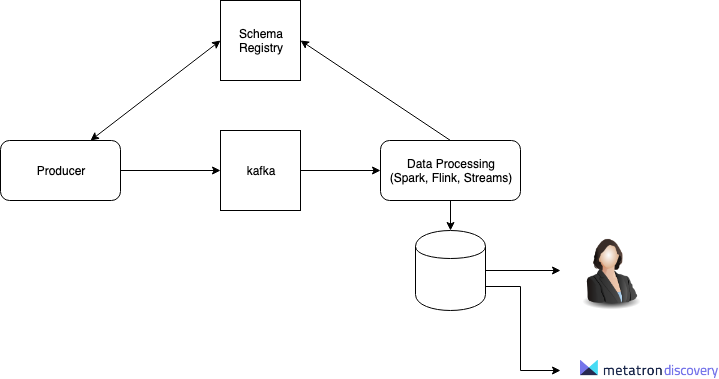

<!-- $theme: default -->

SK Big Data Course 2019, <br/> Big Data Architecture
===

<!-- 2019. 06. 27 ~ 28  -->


<!-- <!-- footer: Copyright (c) 2019 SK Telecom Co. Ltd. All Rights Reserved. -->

---
# Big Data Architecture
**Designing Modern Streaming Data Applications**

<br>
<br>

**김영우** (Youngwoo Kim)
Hi-Tech DT 팀, Data Labs, ICT기술센터, SK 텔레콤

---
# 목차

- 개요
- 빅데이터 아키텍처
  - 스트리밍 데이터 응용을 위한 빅데이터 아키텍처
- 스트리밍 데이터 플랫폼
  - Data Sources
  - Event Hub / Message Broker
  - Data Ingestion / Data Integration
  - Data Storage
  - Stream Processing
  - Data Analytics / SQL / Dashboard & etc.
- Hands-on Labs


---
<!-- page_number: true -->
# 개요
<span style="font-size:20pt">
  
- 스트리밍 데이터 처리 시스템을 구성하기 위해 필요한 구성 요소에 대하여 학습
- 실시간 데이터를 위한 오픈소스 프로젝트와 해당 프로젝트의 특징 학습
- 성공적인 데이터 응용 설계와 개발을 위한 고려사항
- 스트리밍 데이터 아키텍처 시나리오를 바탕으로 e2e 스트리밍 응용 개발 실습

</span>

---
# 빅데이터 아키텍처

---
## 빅데이터?


---
## Big Data & AI Landscape


---
## Data Warehousing & Business Intelligence


---
## Data Application?
### 데이터 애플리케이션
<span style="font-size:20 pt">
  
- 데이터 수집
- 데이터 저장
- 데이터 처리
- 데이터 분석 및 시각화

</span>

### 빅데이터 애플리케이션(시스템) 패턴
<span style="font-size:20pt">
  
- 데이터 생성
- 데이터 수집
- 데이터 저장 / 처리
- 데이터 분석 / 시각화
- **+** 데이터 파이프 라인

</span>


---
## 빅데이터 아키텍처: 구성요소
### Components of a big data architecture [1]


<span style="font-size:14pt">

1. https://docs.microsoft.com/en-us/azure/architecture/data-guide/big-data/

</span>

---
## 스트리밍 데이터 응용을 위한 빅데이터 아키텍처
### Components of the `Streaming Data Architecture`


`Big Data Architecture` **-** (==minus==) `Batch Processing` = ?

---
# Streaming Data Platform


---
## `Fast Data Architecture` [1]
- Data Sources
- Event Bus (a.k.a Event Hub, Message Broker)
  - Transport Layer
- Data Ingestion / Integration
- Data Storage
- Stream Processing
- Data Analytics / SQL / Dashboard / Search & etc.

<span style="font-size:14pt">
  
1. [Fast Data Architectures for Streaming Applications (2nd Edition)](https://www.lightbend.com/ebooks/fast-data-architectures-for-streaming-applications-oreilly-2nd-edition)

</span>

---
## Streaming Data Architecture: Bad and Good [1]


<span style="font-size:12pt">

1. [The Log: What every software engineer should know about real-time data's unifying abstraction](https://engineering.linkedin.com/distributed-systems/log-what-every-software-engineer-should-know-about-real-time-datas-unifying)

</span>

---
### (Streaming) Data Sources
* Log files
* CDC (Transactions)
* Events (Equipments, Sensors…)
* APIs
* Agents
* Microservices
* ......


---
## Streaming Data Platform: Event Hub
### Message Broker?, Why?
> A message broker is an architectural pattern for message validation, transformation, and routing. It mediates communication among applications, minimizing the mutual awareness that applications should have of each other in order to be able to exchange messages, ==effectively implementing decoupling==. [1]
- Event-driven Applications
- Asynchronous Processing

<span style="font-size:14pt">

[1] https://en.wikipedia.org/wiki/Message_broker

</span>

---
### Enterprise Event Hub
- a.k.a Enterprise Event Bus
- ==Immutable append-only data store==
#### Goals for Enterprise Event Bus
- Buffering
- Reliable Storage
- Partitioning
- Replay
- High Throughput

---
<!-- *page_number: false -->
# 엔터프라이즈 이벤트 버스 == `물류창고`?


---
### Key properties for Next-Generation Messaging
- High throughput
- Low latency
- Multi tenancy
- Consistency
- Ease of operations
- Resiliency
- Elasticity

---
### Key properties for Next-Generation Messaging
#### Transmission
- Processing Guarantees (Messaging Semantics)
- Duplication
- Latency
- Ordering

---
### Messaging semantics
- :arrow_forward: message delivery semantics


---
### Stream Processing
#### Requirements of Real-time stream processing [\*]
- Supprting API, DSL, SQL
- Handling Delayed, Missing and Out-of-Order Data
- Integrate Stored and Streaming Data
- Guarantee Data Safety and Availability 
- Partition and Scale Applications Automatically 

<span style="font-size:14pt">
  
\* [The 8 Requirements of Real-Time Stream Processing](http://cs.brown.edu/~ugur/8rulesSigRec.pdf)

</span>

--- 
### (Analytical) Data Store
<span style="font-size:18pt">
  
- **Application characteristics**
- Performance
- Efficiency
- Cost Efficiency
- Quality

</span>

#### One size fits all?
<span style="font-size:14pt">
  
- RDBMS
- Distributed File System
- Object Storage
- Key/Value Store
- Search Engine
- Time Series Database
- OLAP
- Event Bus

</span>

---
### Analytics / SQL / Dashboard & etc.
<span style="font-size:14pt">
  
- Data Applications
  - API
- Querying Data
  - SQL
- Notebooks
  - Jupyter Notebooks
  - Apache Zeppelin  
- Data Discovery
  - metatron discovery
- OLAP
- ML / DL
- Search
- Dashboard

</span>

---
### OSS for Streaming Data Platform

---
#### Components of a `Streaming Data Architecture` (again!)


---
### Data Source & Data Acquisition
* Data Source
:arrow_right:  Gateway / DI

* Network
:arrow_right: Gateway / DI

* Event Bus
:arrow_right: ......

---
#### OSS for Data Source & Data Acquisition
- Apache Flume
- Apache Gobblin
- Kafka Connect
- Fluentd
- Logstash
- Data Integration tools...

---
#### OSS for Message Broker / Enterprise Event Hub
- ==Apache Kafka==
- Apache Pulsar
- RabbitMQ
- Apache ActiveMQ
- Apache Qpid
- Apache RocketMQ
- ZeroMQ

---
#### Apache Kafka
- https://kafka.apache.org/
- High performance pub/sub messaging system
  - Broker
  - Streams
  - Connect
- Key terms
  - Message
  - Broker
  - Producer
  - Consumer
  - topic
  - topic partition
  - Consumer Group

---
#### Apache Kafka :question: Confluent Platform :question: :confused:

---
#### Apache Kafka: Schema Management


<span style="font-size:14pt">

- Apache Kafka + Schema Registry
  - https://github.com/confluentinc/schema-registry
  - https://medium.com/@stephane.maarek/introduction-to-schemas-in-apache-kafka-with-the-confluent-schema-registry-3bf55e401321
- Why Avro For Kafka Data?
  - https://www.confluent.io/blog/avro-kafka-data/

</span>

---
#### Why binary format for event data (Avro or Protobuf)
- Fast serialization / deserialization
- more compact messages
- have a schema of the data
- schema evolution
- ......
- ==Meta data and Data Quality==

---
#### Machine learning and the Apache Kafka ecosystem


<span style="font-size:14pt">

https://www.confluent.io/blog/using-apache-kafka-drive-cutting-edge-machine-learning

</span>

---
#### But Not enough for the Machine learning platform


---
#### Scaling Apache Kafka
##### Tuning Kafka Broker, Producer and Consumer
- Async producer, acks, partitions, compression, Disk I/O ...

##### Tiered Kafka Cluster [1][2]


<span style="font-size:14pt">

1. [Kafka at Scale](https://events.static.linuxfound.org/sites/events/files/slides/Kafka%20At%20Scale.pdf)
2. [Building Scalable and Extendable Data Pipeline for Call of Duty Games: Lessons Learned](https://events.linuxfoundation.org/wp-content/uploads/2017/11/Building-Scalable-and-Extendable-Data-Pipelines-For-Call-Of-Duty-Games-Lessons-Learned-Yaroslav-Tkachenko.pdf)

</span>

---
#### OSS for Stream Processing
- Kafka client for Java, Scala, Python, Go, etc...
- Apache Spark
- Apache Flink
- Apache Samza
- Apache Storm
- Apache Heron
- Apache Samza
- Apache Beam
- ......


---
#### OSS for Data Store
<span style="font-size:18pt">
  
- RDBMS
- Distributed File System
  - Hadoop HDFS
- Object Storage
  - S3
  - Minio, Ceph
- KV Store
  - Apache HBase, Apache Cassandra
  - Redis, FoundationDB
- Search
  - Apache Solr, ElasticSearch
- OLAP
  - Apache Druid, Apache Pinot, Apache Kylin
- Event Bus
  - Apache Kafka, Apache Pulsar & MQs...
- etc.
  - CockroachDB, Apache Kudu...

</span>

---
#### File Format
##### File format for Data Store
- Distributed File System. :arrow_right: HDFS, QFS, & etc…
- Object Storage :arrow_right: S3 or S3 compatible Object Storage
##### Big Data File Formats
- Text (CSV, JSON)
- Apache Avro
- Apache ORC**
- Apache Parquet**

** Columnar storage :arrow_right: ==immutable data and analytics queries==

---
### OSS for Data Analytics / SQL / Dashboard & etc.

##### Data Analytics
- R
- Python, Java, Scala ...
- Jupyter Notebook, Apache Zeppelin
- ML/DL Libs.

##### SQL
- ......

##### Etc.
- Search
  - ElasticSearch, Apache Solr
- Data Discovery tools
  - ......

---
### Lambda Arch. vs Kappa Arch.
#### Lambda Architecture


---
### Lambda Arch. vs Kappa Arch.
#### Kappa Architecture


---
## Stream analytics @ Public Cloud
<span style="font-size:20pt">
  
- AWS
  - https://aws.amazon.com/ko/streaming-data/
- MS Azure
  - https://azure.microsoft.com/en-in/services/stream-analytics/
- GCP
  - https://cloud.google.com/solutions/big-data/stream-analytics/
- ......

</span>

---
# Big Data Architecture
**Designing Modern Streaming Data Applications**

# Hands-on Labs


---
#### Stock Trading(Quote) API를 이용한 실시간 데이터 수집 및 분석
- 데이터 소스
  - Dataset
  - API
- 실시간 데이터 수집
- 스트리밍 데이터 적재
  - Apache Kafka
- 스트리밍 데이터 처리
  - Kafka Streams, Apache Flink
- 데이터 저장
  - Object Storage, RDBMS
- 데이터 처리 및 응용
  - Java, Python, SQL, Jupyter Notebook (Python)


---
# Prerequisites
- Git
  - https://git-scm.com/downloads
- Docker & Docker Compose
  - https://www.docker.com/products/docker-desktop
- Java SE Development Kit 8 (a.k.a Java 8 / JDK 8)
  - https://www.oracle.com/technetwork/java/javase/downloads/jdk8-downloads-2133151.html
- 텍스트 에디터, e.g., VIM, notepad++
- (선택) 선호하는 Java IDE, e.g., Eclipse, IntelliJ
- (선택) Python 3.x

---
## OS 환경

### Linux or MacOS
- RHEL7/CentOS7, Ubuntu 18.04+
- MacOS 10.x.y
### Windows
### Windows + Virtual Machine(via VirtualBox)

---
## Sanity check

##### Git
<span style="font-size:14pt">

```
$ git --version
git version 2.19.2
```

</span>

##### Docker & Docker compose
<span style="font-size:14pt">

```
$ docker --version
Docker version 18.09.0, build 4d60db4
$ docker-compose --version
docker-compose version 1.23.2, build 1110ad01
```

</span>

##### Java8 (JDK8)
<span style="font-size:14pt">

```
$ java -version
java version "1.8.0_192"
Java(TM) SE Runtime Environment (build 1.8.0_192-b12)
Java HotSpot(TM) 64-Bit Server VM (build 25.192-b12, mixed mode)
```

</span>

---
##### (선택) Maven
<span style="font-size:14pt">

```
$ mvn -version
Apache Maven 3.3.9 (bb52d8502b132ec0a5a3f4c09453c07478323dc5; 2015-11-11T01:41:47+09:00)
Maven home: /usr/local/Cellar/maven@3.3/3.3.9/libexec
Java version: 1.8.0_192, vendor: Oracle Corporation
Java home: /Library/Java/JavaVirtualMachines/jdk1.8.0_192.jdk/Contents/Home/jre
Default locale: ko_KR, platform encoding: UTF-8
OS name: "mac os x", version: "10.14.1", arch: "x86_64", family: "mac"
```

</span>

##### (선택) python
<span style="font-size:14pt">

```
$ python --version
Python 3.4.0
```

</span>

##### Misc.
###### IP Address
<span style="font-size:14pt">

```shell
$ ip addr show
$ ipconfig getifaddr en0
```

</span>

---
## 실습을 위한 데이터와 파일

##### https://github.com/youngwookim/skbdc-bda-2019
<span style="font-size:14pt">

```
$ mkdir -p /path/to/workspace
$ cd /path/to/workspace
$ git clone https://github.com/youngwookim/skbdc-bda-2019.git
$ cd skbdc-bda-2019
$ ls -als

```
or <br>

Download https://github.com/youngwookim/skbdc-bda-2019/archive/master.zip or https://github.com/youngwookim/skbdc-bda-2019/archive/master.tar.gz

</span>

---
# 시스템 구성

<br/>
<br/>



---
## 상세 데이터 흐름
<span style="font-size:16pt">

##### Source
- Kafka Client (Producer)
- Avro messages
##### Event Hub (Apache Kafka)
##### Stream Processing
- Apache Flink
- Kafka Streams
##### Data Store
- Log Data Store (Event Bus)
- RDBMS
- Object Storage (Minio)
##### Data processing and analytics
- Python (jupyter notebook)
- SQL (Hive, Presto, etc...)

</span>

---
## 소프트웨어 스택
<span style="font-size:16pt">

- Apache Zookeeper 3.4.9
- Apache Kafka 2.0.0
- Kafka Schema Registry 5.0.0 (confluent)
- Kafka Schema Registry UI 0.9.4
- Apache Flink 1.8.0
- Presto 302
- Minio
- Apache Avro 1.8.2
- JupyterLab
- MySQL
- Tools
  - kadmin, https://github.com/BetterCloud/kadmin
  - Kafka Manager, https://github.com/yahoo/kafka-manager

</span>

---
### Apache Flink
<span style="font-size:14pt">
  
> Apache Flink is a framework and distributed processing engine for ==stateful computations over unbounded and bounded data streams==. Flink has been designed to run in all common cluster environments, perform computations at in-memory speed and at any scale.

</span>

#### Architecture


---
### Presto (a.k.a PrestoSQL)
<span style="font-size:14pt">
  
> Presto is an open source ==distributed SQL query engine== for running interactive analytic queries against data sources of all sizes ranging from gigabytes to petabytes.
- http://prestosql.io

</span>


---
### Metatron Discovery
<span style="font-size:18pt">
  
- Intro. Metatron Discovery
  - https://www.youtube.com/channel/UC5IdHK8qBiN9zVgD7SvO41g

- Demo
  - https://discovery.metatron.app/

</span>


---
### Apache Spark?


---
## Stream Data Platform 개발 환경

---
### Docker 컨테이너
##### 호스트 IP 주소 찾기
<span style="font-size:14pt">

```bash
$ ipconfig getifaddr en0
192.168.1.4

```

</span>

##### Docker 컨테이너 실행
<span style="font-size:14pt">

```bash
# Stop all running containers
$ docker stop $(docker ps -aq)

# Delete all containers
$ docker rm $(docker ps -a -q)

# Delete all images
$ docker rmi $(docker images -q)

$ docker network ls
$ docker network prune
```

```bash
$ cd labs/docker
$ export DOCKER_HOST_IP=192.168.1.4
$ cat docker-compose.yml

$ docker-compose up -d
$ docker-compose ps
```

</span>

---
##### mc (Minio client) 실행

<span style="font-size:14pt">

```bash
$ docker pull minio/mc
$ docker run --net docker_default -it --entrypoint=/bin/sh minio/mc
```

```bash
/ # mc

(snip)
```

</span>

##### Edit `~/.mc/config.json`:

<span style="font-size:14pt">
  
*labs/minio/mc/config.json 참고*
```json
/ # vi ~/.mc/config.json
(snip)
		"local": {
			"url": "http://minio:9000",
			"accessKey": "V42FCGRVMK24JJ8DHUYG",
			"secretKey": "bKhWxVF3kQoLY9kFmt91l+tDrEoZjqnWXzY9Eza",
			"api": "S3v4",
			"lookup": "auto"
		},
(snip)
```
```bash
/ # mc ls local/
[2019-06-24 05:34:07 UTC]      0B customer-data-json/
[2019-06-24 05:34:07 UTC]      0B customer-data-text/
[2019-06-24 05:34:07 UTC]      0B data/
/ # 
```

</span>


---
##### Services
<span style="font-size:18pt">
  
- Single Zookeeper: $DOCKER_HOST_IP:2181
- Single Kafka: $DOCKER_HOST_IP:9092
- Kafka Schema Registry: $DOCKER_HOST_IP:18081
- Kafka Schema Registry UI: $DOCKER_HOST_IP:8001
- Presto: $DOCKER_HOST_IP:8080
- Minio: $DOCKER_HOST_IP:9000

</span>


---
##### Docker Network


> <span style="font-size:14pt"> Networking of (Kafka) docker compose, https://github.com/wurstmeister/kafka-docker/wiki/Connectivity </span>

---
#### Sanity check: Apache Kafka
<span style="font-size:14pt">

- `create` a topic
```
$ export KAFKA_BROKER=$(docker ps --filter name=kafka1 --format={{.ID}})
$ docker exec -t -i "$KAFKA_BROKER" \
kafka-topics --create --topic foo --partitions 1 --replication-factor 1 \
--if-not-exists --zookeeper zoo1:2181

$ docker exec -t -i "$KAFKA_BROKER" \
kafka-topics --create --topic hello --partitions 4 --replication-factor 1 \
--if-not-exists --zookeeper zoo1:2181

$ docker exec -t -i "$KAFKA_BROKER" \
kafka-topics --create --topic world --partitions 8 --replication-factor 1 \
--if-not-exists --zookeeper zoo1:2181
```
```
$ docker exec -t -i "$KAFKA_BROKER" \
kafka-topics --describe --topic foo --zookeeper zoo1:2181

$ docker exec -t -i "$KAFKA_BROKER" \
kafka-topics --describe --topic hello --zookeeper zoo1:2181

$ docker exec -t -i "$KAFKA_BROKER" \
kafka-topics --describe --topic world --zookeeper zoo1:2181
```
</span>

---
<span style="font-size:14pt">

- `delete` a topic
```

$ export KAFKA_BROKER=$(docker ps --filter name=kafka1 --format={{.ID}})
$ docker exec -t -i "$KAFKA_BROKER" \
kafka-topics --zookeeper zoo1:2181 --delete --topic topicName
```

- `list` topic(s)
```

$ export KAFKA_BROKER=$(docker ps --filter name=kafka1 --format={{.ID}})
$ docker exec -t -i "$KAFKA_BROKER" \
kafka-topics --zookeeper zoo1:2181 --list
```

- etc...

---
##### `bin` scripts for Kafka
<span style="font-size:14pt">
  
  
```bash
$ export KAFKA_BROKER=$(docker ps --filter name=kafka1 --format={{.ID}})
$ docker exec -t -i "$KAFKA_BROKER" bash -l
```

```bash
# dpkg -L confluent-kafka-2.11

# ls -als /usr/bin/kafka*

```

</span>

---
#### Test for Kafka producer & consumer
<span style="font-size:14pt">

- `producer`
```bash
$ docker exec -t -i "$KAFKA_BROKER" \
bash -c "seq 100 | kafka-console-producer --request-required-acks 1 \
--broker-list kafka1:9092 --topic foo && echo 'Produced 100 messages.'"

>>>>> ...... >>>>>>Produced 100 messages.
```

- `consumer`
```bash
$ docker exec -t -i "$KAFKA_BROKER" \
kafka-console-consumer --bootstrap-server kafka1:9092 --topic foo \
--from-beginning --max-messages 100

1
2
3

......

99
100
```

</span>

---
#### kadmin: Web UI for Kafka producer/consumer
<span style="font-size:14pt">

- https://github.com/BetterCloud/kadmin

- Running kadmin (on localhost)
```bash
$ cd /path/to/workspace
$ git clone https://github.com/BetterCloud/kadmin.git
$ cd kadmin
$ cd dist
$ cp ../application.properties .
```

- Edit Kadmin conf:
```bash
$ vi application.properties

server.port=9090
```

- Running kadmin:
```bash
$ java -jar shared-kafka-admin-micro-*.jar --spring.profiles.active=kadmin,local

......
...... : Tomcat started on port(s): 9090 (http)
...... : Started Application in 5.27 seconds (JVM running for 5.877)
```

</span>

---
##### Sanity check using kadmin
<span style="font-size:14pt">
  
- Browse `kadmin` web, http://localhost:9090/kadmin/
- Create Kafka topics
```bash
$ export KAFKA_BROKER=$(docker ps --filter name=kafka1 --format={{.ID}})

# test_topic1 topic

$ docker exec -t -i "$KAFKA_BROKER" \
kafka-topics --create --topic test_topic1 --partitions 4 --replication-factor 1 \
--if-not-exists --zookeeper zoo1:2181

# eventcall topic

$ docker exec -t -i "$KAFKA_BROKER" \
kafka-topics --create --topic eventcall --partitions 4 --replication-factor 1 \
--if-not-exists --zookeeper zoo1:2181
```

- Basic producer: `String` -> `String`
- Avro producer: `JSON` -> `AVRO` -> `ByteArray`
  - Schema Registry UI: http://localhost:8001
- `EventCall` Avro Schema
  - [eventcall.avsc](avro/eventcall.avsc)

- EventCall message
  - [eventcall.json](avro/eventcall.json)

</span>

---
#### Kafka Manager
<span style="font-size:14pt">

> A tool for managing Apache Kafka.
- https://github.com/yahoo/kafka-manager

Browse kafka-manager web:
- http://localhost:19000

</span>

##### How to add 'Local' cluster:
<span style="font-size:14pt">
  
- Cluster > `Add Cluster`
- Cluster Name: `DEV`
- Cluster Zookeeper Hosts: `zoo1:2181`
- `Save`

</span>


---
## 데이터 소스

---
### 실습을 위한 데이터

#### NASDAQ symbols
<span style="font-size:14pt">

- https://datahub.io/core/nasdaq-listings

</span>

---
#### nasdaq-listed
<span style="font-size:14pt">

- https://datahub.io/core/nasdaq-listings/r/nasdaq-listed.csv

| Field Name | Order | Type (Format) | Description |
| ---- | ---- | ---- | ---- |
| Symbol	| 1 | string | |
| Company Name |	2 |	string| |
| Security Name | 3 | string | |
| Market Category | 4 | string | |
| Test Issue	| 5	| string | |
| Financial Status | 6 |	string | |
| Round Lot Size	| 7	| number | |

</span>

---
#### nasdaq-listed-symbols
<span style="font-size:14pt">

- https://datahub.io/core/nasdaq-listings/r/nasdaq-listed-symbols.csv

| Field Name | Order | Type (Format) | Description |
| ---- | ---- | ---- | ---- |
| Symbol | 1 | string | |
| Company Name | 2 | string | |


</span>

---
#### Stock Quote API

##### IEX Cloud API
<span style="font-size:14pt">

- https://iexcloud.io/docs/api/
- IEX Cloud is a platform that makes financial data and services accessible to everyone.
- iextrading4j
  - https://github.com/WojciechZankowski/iextrading4j

</span>

<span style="font-size:12pt">

```java
final IEXCloudClient iexTradingClient = IEXTradingClient.create(IEXTradingApiVersion.IEX_CLOUD_BETA_SANDBOX,
              new IEXCloudTokenBuilder()
                      .withPublishableToken("Tpk_18dfe6cebb4f41ffb219b9680f9acaf2")
                      .withSecretToken("Tsk_3eedff6f5c284e1a8b9bc16c54dd1af3")
                      .build());
final Quote quote = iexTradingClient.executeRequest(new QuoteRequestBuilder()
        .withSymbol("AAPL")
        .build());
System.out.println(quote);
```

> Quote{symbol=AAPL, companyName=Apple, Inc., primaryExchange=null, sector=null, calculationPrice=close, open=208.3, openTime=1565030786525, close=200.18, closeTime=1618408074295, high=207.68, low=199.32, latestPrice=198.97, latestSource=Close, latestTime=June 19, 2019, latestUpdate=1629414771181, latestVolume=21938828, iexRealtimePrice=200.09, iexRealtimeSize=104, iexLastUpdated=1579260527164, delayedPrice=198.86, delayedPriceTime=1592686867485, extendedPrice=198.9, extendedChange=0.54, extendedChangePercent=0.00277, extendedPriceTime=1614799731031, previousClose=203.47, change=-0.59, changePercent=-0.00296, iexMarketPercent=0.0236840881544615, iexVolume=496646, avgTotalVolume=31079954, iexBidPrice=0, iexBidSize=0, iexAskPrice=0, iexAskSize=0, marketCap=922850939808, peRatio=16.8, week52High=241.05, week52Low=143, ytdChange=0.2633361185170389, bidPrice=null, bidSize=null, askPrice=null, askSize=null}


</span>

---
##### IEX Cloud API, `Quote` 
##### 주식 시세
<span style="font-size:14pt">
  
- https://iexcloud.io/docs/api/#quote
- https://github.com/WojciechZankowski/iextrading4j/blob/master/iextrading4j-api/src/main/java/pl/zankowski/iextrading4j/api/stocks/Quote.java

</span>

##### Avro schema for IEX Cloud 'Quote':
<span style="font-size:14pt">
  
- [labs/avro/iextrading.avsc](labs/avro/iextrading.avsc)

</span>

---
### Kafka Message Generator
<span style="font-size:14pt">

Create `iextrading` Kafka topic for `Quote` data:
```
$ export KAFKA_BROKER=$(docker ps --filter name=kafka1 --format={{.ID}})
$ docker exec -t -i "$KAFKA_BROKER" \
kafka-topics --create --topic iextrading --partitions 4 --replication-factor 1 \
--if-not-exists --zookeeper zoo1:2181

```

IEX Cloud `Quote` Avro 스키마 등록(선택):
 - http://127.0.0.1:8001
 - labs/avro/iextrading.avsc

Running Kafka producer:
```
$ cd labs/kafka-message-gen
$ ./mvnw clean package
$ java -jar target/kafka-message-gen-1.0.0.jar

```

확인?
- (STDOUT) logs from 'kafka-message-gen'
- (console) Avro consumer
- (web) kadmin

</span>


---
## Data Processing

---
### Apache Flink Streaming Applicaltion
<span style="font-size:14pt">

- Setup Flink local cluster
  - https://ci.apache.org/projects/flink/flink-docs-stable/tutorials/local_setup.html

- Download Flink tarball:
  - https://flink.apache.org/downloads.html#apache-flink-180

```bash
$ cd labs/flink-local
$ wget http://mirror.apache-kr.org/flink/flink-1.8.0/flink-1.8.0-bin-scala_2.11.tgz

```

</span>

##### Starting & Stopping Flink local cluster
<span style="font-size:14pt">

```bash
$ bin/start-cluster.sh  # Start Flink
$ ps aux | grep flink
......

$ bin/stop-cluster.sh  # Stop Flink

```

> For Windows: https://ci.apache.org/projects/flink/flink-docs-release-1.8/tutorials/flink_on_windows.html

</span>

---
#### Flink + S3 (hadoop)
##### Edit Flink ==filnk-conf.yaml== file
<span style="font-size:14pt">

```bash
$ tar xvfz ...
$ cd flink-[VERSION]
$ vi conf/flink-conf.yaml
```
```
# Minio(S3)
state.backend: filesystem
s3.endpoint: http://127.0.0.1:9000
s3.path-style: true
s3.access-key: V42FCGRVMK24JJ8DHUYG
s3.secret-key: bKhWxVF3kQoLY9kFmt91l+tDrEoZjqnWXzY9Eza
```

</span>

##### Copy required jars into 'lib' directory
<span style="font-size:14pt">

- flink-s3-fs-hadoop
```
$ cp opt/flink-s3-fs-hadoop-1.8.0.jar lib/
```
- flink-shaded-hadoop
  - [flink-shaded-hadoop-2-uber-2.8.3-7.0.jar](https://repo.maven.apache.org/maven2/org/apache/flink/flink-shaded-hadoop-2-uber/2.8.3-7.0/flink-shaded-hadoop-2-uber-2.8.3-7.0.jar)

</span>

##### Restart Flink local cluster
```bash
```

---
#### Apache Flink (batch) example

##### Source code for Apache Flink (batch) example:
<span style="font-size:14pt">

- https://ci.apache.org/projects/flink/flink-docs-release-1.8/dev/batch/examples.html#word-count

</span>

##### Dataset for example:
<span style="font-size:14pt">

- http://www.gutenberg.org/ebooks/4300

</span>

##### Create Minio(S3) bucket via Minio WebUI:
<span style="font-size:14pt">

- http://127.0.0.1:9000

</span>

##### Creating required buckets:
<span style="font-size:14pt">

- `test`
- `flink` (for checkpoints)
- `iextrading` (for Stock quote data)

</span>

##### Create 'iextrading' bucket
<span style="font-size:14pt">

```
# mc mb local/iextrading
# mc mb local/flink
# mc mb local/test
```

</span>

---
##### Running Flink (batch) example
<span style="font-size:14pt">

```bash
$ cd labs/docker/flink-local
$ cd flink-[VERSION]
$ bin/flink run examples/batch/WordCount.jar \
--input s3://data/gutenberg/4300-0.txt \
--output s3://test/wordcount/output
```
</span>

##### Flink Dashboard:
<span style="font-size:14pt">
  
- http://localhost:8081

</span>

##### Verify example' output
<span style="font-size:14pt">

- verify the result in using Minio Web: http://localhost:9000

- verify the result(text file) in using Minio mc:
```
# mc cat local/test/wordcount/output

```

</span>

---
#### Runnig Flink-Kafka streaming application

##### 데이터 흐름
<span style="font-size:14pt">

- Trading(Quote) API -> Kafka Producer -> Kafka -> Flink Streaming -> Minio(S3)

</span>

##### Builing Flink Kafka application
<span style="font-size:14pt">

```
$ cd /path/to/workspace/skbdc-bda-2019/
$ cd labs/flink-kafka-streaming
$ ./mvnw clean package

```
</span>

##### Running Flink streaming app on local cluster
<span style="font-size:14pt">

```
$ cd labs/flink-local
$ cd flink-[VERSION]
$ bin/flink run ../../flink-kafka-streaming/target/flink-kafka-streaming-1.0.0.jar \
--input-topic iextrading \
--output-path s3://iextrading/filtered/ \
--bootstrap.servers localhost:9092 \
--schema-registry-url http://localhost:18081 \
--group.id cgrp1
```

</span>

---
##### Logs & output
<span style="font-size:14pt">
  
- Logs & STDOUT:
  - log/flink-...log
  - log/flink-...out

- Apache Flink Dashboard:
  - http://localhost:8081

- Output file(object) from Flink Streaming Application

  
```bash
# mc cat local/iextrading/filtered/YYYY-MM-DD/[part file]

E.g.,
# mc cat local/iextrading/filtered/2019-06-18/part-0-0

```

</span>


---
### Kafka Streams 'filter' Application

<span style="font-size:14pt">
  
- Kafka `iextrading_filtered` topic -> Kafka Streams (filter) -> Kafka `iextrading_filtered`

</span>

##### Create 'iextrding_filtered' Kafka topic:
<span style="font-size:14pt">

```bash
$ export KAFKA_BROKER=$(docker ps --filter name=kafka1 --format={{.ID}})
$ docker exec -t -i "$KAFKA_BROKER" \
kafka-topics --create --topic iextrading_filtered --partitions 4 --replication-factor 1 \
--if-not-exists --zookeeper zoo1:2181
```
</span>

##### Create 'iextrading_filtered-value' schema
<span style="font-size:14pt">

- http://localhost:8001

</span>

##### Building & running Kafka Streams application
<span style="font-size:14pt">

```bash
$ cd labs/kafka-streams-bda
$ ./mvnw clean package
$ java -cp target/kafka-streams-bda-1.0.0-standalone.jar com.example.KafkaStreamsApp
```

</span>

##### Verify events from 'iextrading_filtered' topic
<span style="font-size:14pt">

```bash
$ export KAFKA_SR=$(docker ps --filter name=kafka-schema-registry --format={{.ID}})
$ docker exec -t -i "$KAFKA_SR" \
  kafka-avro-console-consumer --topic iextrading_filtered --bootstrap-server kafka1:19092 \
  --property schema.registry.url="http://kafka-schema-registry:8081"
```

</span>

---
## Streaming Data Integration

<span style="font-size:14pt">
  
- Apache Kafka - 'iextrading_filtered' topic -> Kafka Streams -> RDBMS(MySQL)

</span>

##### Running MySQL server
<span style="font-size:14pt">

```bash
$ docker run -d --name mysql1 --network docker_default -p 3306:3306 -e MYSQL_ROOT_PASSWORD=mypasswd -d mysql:5.7

```
</span>

##### Running MySQL CLI
<span style="font-size:14pt">

```bash
$ docker run -it --network docker_default --rm mysql mysql -hmysql1 -uroot -pmypasswd

```

</span>


---
### Schema for `iextrading_filtered` table
<span style="font-size:14pt">


| Column Name  | Data type | Description |
| ---- | ---- | ---- |
| ts  | timestamp  | |
| symbol  | varchar(10)  | |
| company_name  | varchar(100)  | |
| low  | double  | |
| high  | double  | |
| latest_update  | double  | |
| latest_price | double | |

</span>

#### DDL for MySQL
<span style="font-size:14pt">


```sql
mysql> CREATE DATABASE stock;

mysql> USE stock;

mysql> CREATE TABLE iextrading_filtered
( 
  ts TIMESTAMP DEFAULT CURRENT_TIMESTAMP PRIMARY KEY,
  symbol varchar(10),
  company_name varchar(100),
  low double,
  high double,
  latest_update double,
  latest_price double
);
```

</span>


---
#### Building Kafka Streams application
<span style="font-size:14pt">

```bash
$ cd /path/to/labs/kafka-streams-proc/
$ ./mvnw clean package

```
</span>

#### Running Kafka Streams application
<span style="font-size:14pt">

```bash
$ java -cp target/kafka-streams-proc-1.0.0-standalone.jar \
com.example.KafkaStreamsProcessor

```

</span>

#### Querying MySQL table `iextrading_filtered`
<span style="font-size:14pt">

```bash
$ docker run -it --network docker_default --rm mysql mysql -hmysql1 -uroot -pmypasswd
```
```sql
mysql> USE stock;
mysql> SELECT * FROM iextrading_filtered limit 10;

```

</span>

---
## Data Analytics / SQL / Dashboard

---
## SQL
Querying the wordcount result in using [Presto](https://prestosql.io/)

==Presto== is a distributed SQL query engine designed to query large data sets distributed over one or more heterogeneous data sources.

---
### Querying data from Object Storage
##### Make `warehouse` bucket for presto-hive connector:
<span style="font-size:14pt">

```bash
# mc mb local/warehouse
```

</span>

##### Running Presto CLI:

<span style="font-size:14pt">

```bash
$ docker exec -it presto bash -l

# presto-cli

or

$ docker exec -it presto presto-cli
```

</span>

---
<span style="font-size:14pt">

```sql
presto> SHOW CATALOGS;
  Catalog  
-----------
 blackhole
 jmx       
 memory    
 minio     
 system    
 tpcds     
 tpch  

presto> SHOW SCHEMAS FROM minio;
        Schema       
 --------------------            
  information_schema

presto> CREATE SCHEMA minio.default;

# create 'skbdc' schema...
presto> CREATE SCHEMA minio.skbdc;

```

</span>

---
<span style="font-size:14pt">

```sql
presto> SELECT * FROM system.metadata.table_properties;

presto> CREATE TABLE minio.default.gutenberg (txt varchar)
        WITH (
          format = 'TEXTFILE',
          external_location = 's3a://data/gutenberg/'
        );

presto> CREATE TABLE minio.default.wordcount (line varchar)
        WITH (
          format = 'TEXTFILE',
          external_location = 's3a://test/wordcount/'
        );

presto> SELECT split(line, ' ')[1] as word, split(line, ' ')[2] as cnt 
        FROM minio.default.wordcount;
```
```sql
presto> CREATE VIEW minio.default.v_wordcount 
        AS SELECT split(line, ' ')[1] AS word, split(line, ' ')[2] AS cnt 
           FROM minio.default.wordcount;

presto> CREATE TABLE minio.skbdc.wordcount_top100
        AS SELECT * from minio.default.v_wordcount ORDER BY cnt DESC LIMIT 100;

presto> SELECT * FROM minio.skbdc.wordcount_top100;

presto> SELECT count(1) FROM minio.default.v_wordcount;

presto> SELECT * FROM minio.default.v_wordcount;

```

</span>

---
### Presto table for filtered `Quote` data
<span style="font-size:14pt">


```sql
presto> SELECT * FROM system.metadata.table_properties;

presto> CREATE TABLE minio.default.iextrading_filtered (
          uts double,
          symbol varchar(10),
          high double,
          low double,
          latest_price double,
          latest_update varchar(100) )
        WITH (
          format = 'TEXTFILE',
          external_location = 's3a://iextrading/filtered/YYYY-MM-DD/'
        );

presto> SELECT * FROM minio.default.iextrading_filtered;

presto> CREATE TABLE minio.skbdc.stock_2019
        AS SELECT from_unixtime(uts) AS ts, symbol, latest_price 
           FROM minio.default.iextrading_filtered;

```

</span>


---
## Data Analytics    
##### Building `datascience` Docker image
<span style="font-size:14pt">
  
https://github.com/youngwookim/my-docker-stacks
- JupyterLab
- Python modules... boto3, pymysql, pandas, etc.

```bash
$ cd /path/to/workspace
$ git clone https://github.com/youngwookim/my-docker-stacks.git
$ cd my-docker-stacks
$ cd jupyter-ds
$ docker build --rm -t youngwookim/my-datascience-notebook .
```
</span>

##### Running JupyterLab via Docker:
<span style="font-size:14pt">

```bash
$ cd labs
$ docker run --rm --network docker_default --user root -p 8888:8888 -e GRANT_SUDO=yes -e JUPYTER_ENABLE_LAB=yes -v "$PWD":/home/jovyan youngwookim/my-datascience-notebook:latest

......

Copy/paste this URL into your browser when you connect for the first time,
    to login with a token:
        http://(be1ee3cbaf72 or 127.0.0.1):8888/?token=42a319245ef11fc8b5fbae2480fd3b3da557489b05f4f357
```

http://localhost:8888/?token=42a319245ef11fc8b5fbae2480fd3b3da557489b05f4f357


</span>


---
##### Crunching S3 data with Jupyter Notebook
<span style="font-size:14pt">
  
  - [labs/notebooks/minio-s3-python-pandas.ipynb](labs/notebooks/minio-s3-python-pandas.ipynb)

</span>

##### Visualization MySQL data in Jupyter Notebook
<span style="font-size:14pt">
  
- Plotting data using python(pandas, pymysql, matplotlib) on Jupyter Notebook:
  
  - [labs/notebooks/kafka-mysql-pandas-plot.ipynb](labs/notebooks/kafka-mysql-pandas-plot.ipynb)

</span>

---
## Dashboard

---
### Apache Superset (incubating)
<span style="font-size:14pt">

- https://superset.incubator.apache.org/
- Apache Superset (incubating) is a modern, enterprise-ready business intelligence web application
- [How Superset and Druid Power Real-Time Analytics at Airbnb | DataEngConf SF '17](https://www.youtube.com/watch?v=W_Sp4jo1ACg)

</span>

##### Superset Docker 컨테이너 실행
<span style="font-size:14pt">

```bash
$ docker run --network docker_default -d --name superset \
-p 8088:8088 tylerfowler/superset
```

Browse http://localhost:8088

</span>

##### Login with a default username and password of:
<span style="font-size:14pt">
  
```text
username: admin
password: superset
```

</span>

##### 데이터 소스
<span style="font-size:14pt">
  
```text
presto://[HOST_IP]:8080/minio

e.g., presto://presto:8080/minio
```

</span>

---
### Metatron Discovery
##### Metatron Discovery Docker 컨테이너 실행
<span style="font-size:14pt">
  
* https://metatron.app/download/installation-guide-docker/

```bash
$ cd labs
$ docker run  -i -d --rm -m 6G \
--network docker_default \
-p 8180:8180 \
--name metatron-discovery metatronapp/discovery:latest

```

##### Browse metatron discovery:
  
- http://localhost:8180


##### Login with a default username and password of:
  
```text
username: admin
password: admin
```

</span>


---
# 참고
<span style="font-size:14pt">

- https://docs.microsoft.com/en-us/azure/architecture/data-guide/big-data/
- https://cdn.oreillystatic.com/en/assets/1/event/278/Architecting%20a%20next-generation%20data%20platform%20Presentation%203.pdf
- https://www.slideshare.net/arunkejariwal/designing-modern-streaming-data-applications-115037555
- https://blog.newrelic.com/engineering/kafka-best-practices/
- https://community.hortonworks.com/articles/80813/kafka-best-practices-1.html
- https://www.slideshare.net/JayKreps1/i-32858698
- https://engineering.linkedin.com/distributed-systems/log-what-every-software-engineer-should-know-about-real-time-datas-unifying
- https://www.slideshare.net/hadooparchbook/architectural-considerations-for-hadoop-applications
- https://www.youtube.com/watch?v=oCW5y4_8uGU
- https://www.youtube.com/watch?v=W_Sp4jo1ACg
- https://ci.apache.org/projects/flink/flink-docs-release-1.8/
- https://prestosql.io/
- https://min.io/
- https://github.com/jupyterlab/jupyterlab

</span>

---
# Image Credits
<span style="font-size:14pt">

- https://mattturck.com/bigdata2018/
- https://www.thoughtworks.com/insights/blog/agile-data-warehousing-and-business-intelligence-action
- http://insight360.com/big-data/data-stores/
- https://en.wikipedia.org/wiki/Apache_Kafka
- https://www.talend.com/blog/2017/08/28/lambda-kappa-real-time-big-data-architectures
- https://subscription.packtpub.com/book/big_data_and_business_intelligence/9781786466228/1/ch01lvl1sec8/architecture
- https://www.starburstdata.com/learn-presto/reference-architectures/
- https://docs.microsoft.com/en-us/azure/architecture/data-guide/big-data/
- https://engineering.linkedin.com/distributed-systems/log-what-every-software-engineer-should-know-about-real-time-datas-unifying
- https://cbmpress.com/toronto/%EC%95%84%EB%A7%88%EC%A1%B4-%EC%BA%90%EB%82%98%EB%8B%A4-%EB%8C%80%ED%98%95%EA%B8%89-%EB%AC%BC%EB%A5%98%EC%B0%BD%EA%B3%A0-%ED%97%88%EB%B8%8C-gta%EC%97%90-%EA%B1%B4%EC%84%A4-%EB%B0%9C%ED%91%9C/
- https://www.memsql.com/blog/exactly-once-semantics-with-apache-kafka/
- https://www.talend.com/blog/2017/08/28/lambda-kappa-real-time-big-data-architectures/
- https://www.oreilly.com/ideas/applying-the-kappa-architecture-in-the-telco-industry
- https://www.starburstdata.com/learn-presto/reference-architectures/

</span>

---
<!-- *page_number: false -->

